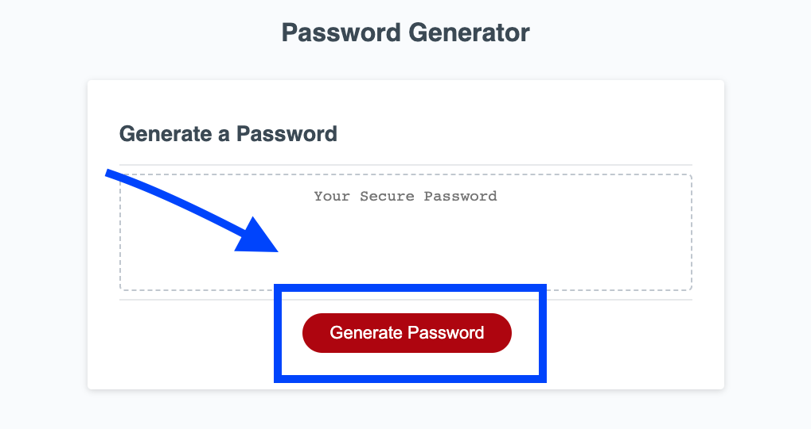
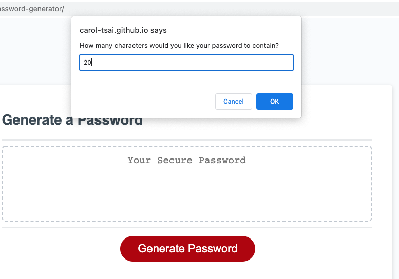
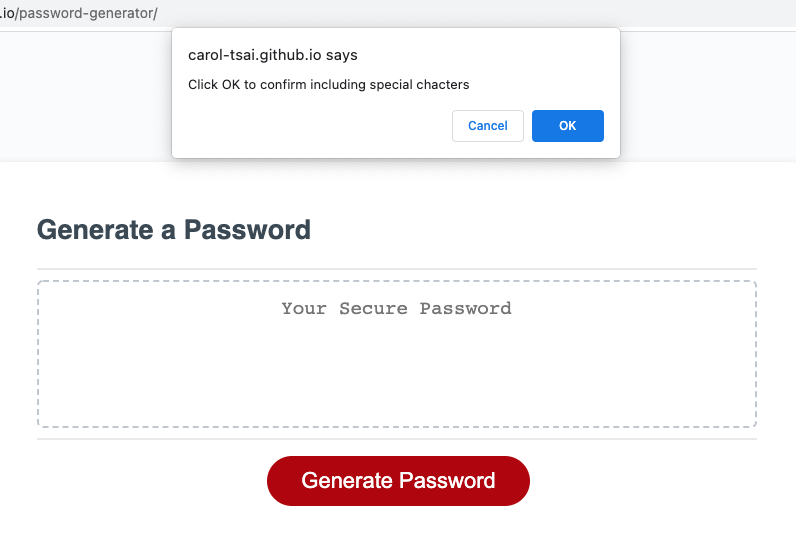
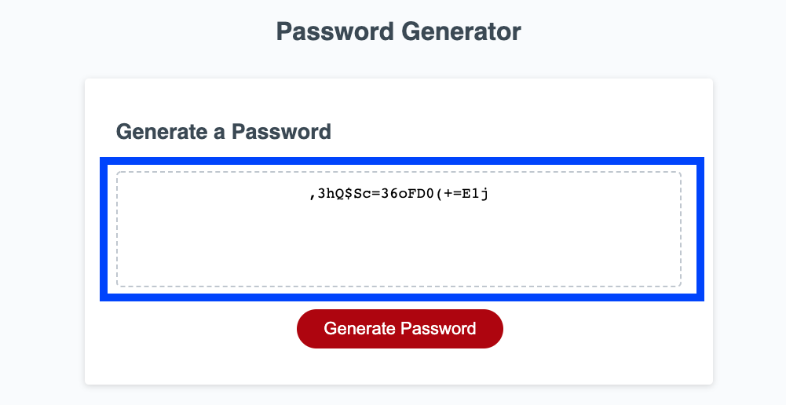

# Password Generator

## Description

When handling sensitive information, it is important to protect our information using strong passwords. This application will generate a random, secure password given the inputs of password length and types you characters you want to include. The application will ask you for the parameters for your password using window prompts and confims. Using this application will help you to ensure that your information is protected with secure passwords.

### What I learned
While doing this project I learned to create window alerts, confirms, and prompts in javascript. I also learned to use the math functions in order to generate random characters for the password.

## Usage

The webpage can be found at [this link](https://carol-tsai.github.io/password-generator/)

To generate a password, click the red "Generat Password" button.

The window will then prompt you to input the desired length for your password. Type in that number and click "Ok". The password length must be at least 8 characters long and no longer than 128 characters.

The window will then ask you if you want to include different character types (special characters, numbers, lower case letter, and upper case characters). Click "Ok" for yes and "Cancel for no".

After answering the prompts, a secure and unique password will be generated and displayed in the output box.

## Credits

Code for the index.html and stylesheet files was copied from UPenn LPS Coding Bootcamp course material.

### Reference documents

* [MDN Web Docs on window.alert()](https://developer.mozilla.org/en-US/docs/Web/API/Window/alert)

* [MDN Web Docs on window.confirm()](https://developer.mozilla.org/en-US/docs/Web/API/Window/confirm)

* [MDN Web Docs on window.prompt()](https://developer.mozilla.org/en-US/docs/Web/API/Window/prompt)

* [MDN Web Docs on Math](https://developer.mozilla.org/en-US/docs/Web/JavaScript/Reference/Global_Objects/Math)

## How to Contribute
Please reach out to me at carol.tsai0224@gmail.com if you would like to contribute to this project.

## License

MIT License

Copyright (c) 2022 Carol Tsai

Permission is hereby granted, free of charge, to any person obtaining a copy
of this software and associated documentation files (the "Software"), to deal
in the Software without restriction, including without limitation the rights
to use, copy, modify, merge, publish, distribute, sublicense, and/or sell
copies of the Software, and to permit persons to whom the Software is
furnished to do so, subject to the following conditions:

The above copyright notice and this permission notice shall be included in all
copies or substantial portions of the Software.

THE SOFTWARE IS PROVIDED "AS IS", WITHOUT WARRANTY OF ANY KIND, EXPRESS OR
IMPLIED, INCLUDING BUT NOT LIMITED TO THE WARRANTIES OF MERCHANTABILITY,
FITNESS FOR A PARTICULAR PURPOSE AND NONINFRINGEMENT. IN NO EVENT SHALL THE
AUTHORS OR COPYRIGHT HOLDERS BE LIABLE FOR ANY CLAIM, DAMAGES OR OTHER
LIABILITY, WHETHER IN AN ACTION OF CONTRACT, TORT OR OTHERWISE, ARISING FROM,
OUT OF OR IN CONNECTION WITH THE SOFTWARE OR THE USE OR OTHER DEALINGS IN THE
SOFTWARE.
